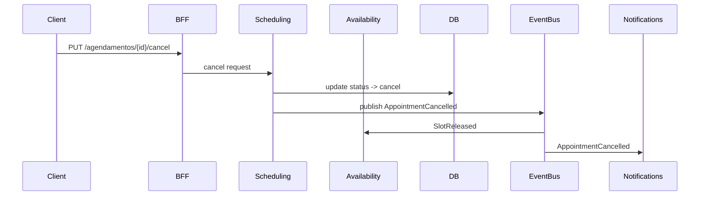

# Arquitetura Macro — Sistema de Agendamento para Barbearia (V1)

> **Template usado:** `TEMPLATE PADRÃO - DOCUMENTO Modelo de Arquitetura Macro v2.0 (com Metodologia Organizacional)`

**Autor:** Ryuji Morimoto — Wakagashira / O Engenheiro do Clã

**Versão:** 1.0

**Data:** 2025-12-03

---

## 1. Resumo executivo

Este documento entrega a **Arquitetura Macro** para a V1 do sistema de agendamento da barbearia. Ele define módulos, boundaries, containers, contratos públicos, eventos, responsabilidades de dados, decisões organizacionais e as próximas entregas (Arquitetura Micro por módulo). O objetivo: fornecer um mapa técnico implementável e sem ambiguidade, priorizando os módulos críticos (Scheduling e Availability).

Referências: documentos de Contexto de Negócio, Escopo V1, Modelo de Entidades e Ciclo de Vida recebidos. fileciteturn0file1 fileciteturn0file2 fileciteturn0file3 fileciteturn0file0

---

## 2. Objetivo da V1

Fornecer o fluxo essencial: clientes visualizam horários, agendam automaticamente, barbeiros podem marcar faltas, admin configura unidades/serviços/barbeiros. Notificações via browser push quando permitidas. Pagamentos e penalidades automáticas ficam fora da V1.

---

## 3. Mapa de Módulos (Visão Macro)

Lista de módulos principais — cada um com responsabilidade concisa, dono dos dados e contratos públicos (resumo):

1. **Auth** — autenticação e emissão de sessão/tokens. Dono: identidade do usuário.
2. **User Profile** — CRUD e canonicalização de usuários (cliente, barbeiro, admin). Dono: `Usuario`.
3. **Administration** — gestão de Unidades, Serviços, Configurações. Dono: `Unidade`, `Servico`, `ConfigUnidade`.
4. **Barber Management** — perfil e vínculo barbeiro↔unidade, agenda do barbeiro. Dono: `Barbeiro`.
5. **Service Catalog** — catálogo de serviços por unidade. Dono: `Servico`.
6. **Availability / Slot Generator** — gera janelas/slots disponíveis; aplica buffers e capacidade. Dono: geração e bloqueios (persistência parcial).
7. **Scheduling (Agendamento)** — core de criação e transições de agendamento (agendado/cancelado/falta). Dono: `Agendamento`.
8. **Notifications** — push subscriptions, enfileiramento de lembretes e envio. Dono: `NotificationSubscription`.
9. **Audit & Activity** — grava ações sensíveis (append-only). Dono: `audit_logs`.
10. **Shared / Common** — infra e utilitários (DB clients, cache, queues, logging).
11. **Web Frontend / BFF** — camada de apresentação / BFFs separados para cliente e staff.

> Observação: cada módulo será detalhado em documento Micro seguindo o template `Gerador de Arquitetura Micro`.

---

## 4. C4 — Contexto (nível 1)

```mermaid
flowchart LR
  Cliente[Cliente (web/mobile)] -->|utiliza| WebApp[Web Frontend / BFF]
  Barbeiro[Barbeiro (staff)] -->|utiliza| StaffApp[Staff Web App / BFF]
  WebApp -->|REST/gRPC| API[Backend API Gateway]
  API -->|calls| Auth
  API -->|calls| Scheduling
  API -->|calls| Availability
  API -->|calls| UserProfile
  API -->|calls| Administration
  API -->|publishes| EventBus[(Event Bus)]
  EventBus --> Notifications
  EventBus --> Audit
  EventBus --> Scheduling
  Scheduling --> Database[(Database - Agendamentos & Entidades)]
  Availability --> Cache[(Cache / Redis)]
```

**Pessoas externas:** Cliente final, Barbeiro, Dono/Admin.

---

## 5. C4 — Containers (nível 2)

Conteinerização lógica — cada módulo pode ser deployado como um ou mais containers/microservices:

- **API Gateway / BFF (node/ts ou similar)**
  - responsabilidades: composição de chamadas, autenticação leve, expor endpoints públicos.

- **Auth Service**
  - responsabilidades: login cliente (telefone/OTP), login staff (email+senha), tokens, sessões.

- **User Service**
  - responsabilidades: persistência e regras de usuário, perfil e roles.

- **Administration Service**
  - responsabilidades: unidades, serviços, configs.

- **Barber Service**
  - responsabilidades: perfil barbeiro, disponibilidade manual.

- **Availability Service**
  - responsabilidades: geração de slots, bloqueio/lock, cache.

- **Scheduling Service**
  - responsabilidades: gerenciar agendamentos e estados, transições, integridade.

- **Notifications Worker / Service**
  - responsabilidades: consumo de eventos, envio push, agendamento de lembretes.

- **Event Bus / Message Broker**
  - responsabilidades: pub/sub para eventual consistency (RabbitMQ / Kafka / managed).

- **Database cluster** (RDBMS principal + Redis)
  - responsabilidades: persistência ACID dos agendamentos e entidades; cache para disponibilidade.

- **Audit / Analytics store** (append-only)

---

## 6. C4 — Componentes (foco: Scheduling & Availability)

### Scheduling (component breakdown)

- **API Handler (controllers)** — input validation, auth check, chamar caso de uso.
- **Use Cases / Application Services** — `CreateAppointment`, `CancelAppointment`, `MarkNoShow`.
- **Domain** — `Appointment` aggregate, domain events (AppointmentCreated, AppointmentCancelled, AppointmentNoShow).
- **Repository** — `AppointmentRepository` (interface) + `AppointmentPgRepository` (impl).
- **Integration** — `SlotClient` (Availability), `NotificationPublisher` (EventBus), `AuditPublisher`.

**Sequência simplificada (Agendar):**
1. BFF -> Scheduling API `POST /agendamentos` (dados + token)
2. Scheduling Use Case chama Availability.lock (sync) -> recebe reservation token
3. Scheduling persiste `Appointment` (estado `agendado`) numa transação
4. Scheduling publica `AppointmentCreated` no EventBus
5. Notifications consome e agenda lembretes

### Availability (component breakdown)

- **Slot Generator** — algoritmo para gerar slots on-demand por unidade/serviço/data.
- **Locking/Reservation Manager** — reserva curta (optimistic token) para evitar double-booking.
- **Cache Layer (Redis)** — caching de disponibilidade e reservation tokens.
- **Persistence for exceptions/blocks** — bloqueios manuais, feriados, eventos.
- **Public API** — `GET /units/{id}/availability?service=&date=`, `POST /slots/lock`, `POST /slots/release`.

**Regras críticas:**
- geração considera `hora_abre/hora_fecha`, `duracao_servico`, `capacidade_por_hora`, `buffer`.
- lock deve ser atômico: sucesso = token retornado, falha = conflito.

---

## 7. Contratos Públicos (APIs e Eventos principais)

### APIs (alta prioridade para V1)
- `POST /auth/login-client` — body: `{ telefone }` → resposta: `{ sessionToken, usuario }`.
- `POST /auth/login-staff` — body: `{ email, senha }`.
- `GET /units/{id}/availability` — query: `service, date`.
- `POST /slots/lock` — body: `{ unitId, barberId?, serviceId, start, end }` → `{ reservationToken }`.
- `POST /agendamentos` — body: `{ clienteId, unitId, serviceId, barberId?, start, reservationToken }`.
- `PUT /agendamentos/{id}/cancel`.
- `PUT /agendamentos/{id}/falta`.

### Eventos (EventBus)
- `AppointmentCreated { agendamentoId, clienteId, unitId, start, serviceId }`.
- `AppointmentCancelled { agendamentoId, motivo? }`.
- `AppointmentNoShow { agendamentoId }`.
- `SlotLocked { reservationToken, unitId, start, end }`.
- `SlotReleased { reservationToken }`.
- `UserCreated { userId, tipo }`.

> Observação: os eventos devem ser compactos e idempotentes; versão de payload é obrigatória (`v1`).

---

## 8. Ownership de Dados e Consistência

- **Fonte de verdade (single source of truth)**
  - `Agendamento` → Scheduling Service + RDBMS.
  - `Usuario` → User Profile Service.
  - `Unidade` / `Servico` → Administration Service.
  - `Slots` → gerados por Availability; bloqueios persistidos em reserva/exceptions table.

- **Modelo de consistência**
  - Agendamento exige **consistência forte** entre lock e persistência (transactional reservation pattern).
  - Depois da criação, comunicações secundárias (Notifications, Audit) são **eventual consistent** via EventBus.

---

## 9. Concorrência e Estratégia de Lock

**Requisito:** evitar double-booking.

**Opções (decisão recomendada para V1):**
1. **Row-level DB lock:** transação na tabela `reservations` com `SELECT ... FOR UPDATE` — simples e robusto.
2. **Optimistic reservation token + compare-and-set no Redis:** lock curto em cache + verificação na persistência antes do commit.

**Recomendação:** iniciar com **row-level lock + reservation table** (menos dependente de infra adicional). Migrar para Redis CAS se a performance exigir.

---

## 10. Non-functional requirements (V1)

- **RPO/RTO:** Nível operacional — perda de mensagens não crítica, mas agendamentos não podem sumir.
- **SLA:** 99.5% para APIs críticas (availability/booking endpoints).
- **Segurança:** dados pessoais (telefone, email) devem ser armazenados criptografados onde aplicável; autenticação via tokens; proteção contra brute-force de OTP.
- **Observabilidade:** logs estruturados, métricas para: taxa de bookings, taxa de conflitos de lock, tempo de geração de disponibilidade, filas de notifications.

---

## 11. Diagramas Mermaid (fluxos principais)

### Fluxo: Agendar uma janela

```mermaid
sequenceDiagram
  participant Client
  participant BFF
  participant Availability
  participant Scheduling
  participant DB
  Client->>BFF: POST /agendamentos {dados}
  BFF->>Availability: POST /slots/lock
  Availability-->>BFF: 200 {reservationToken}
  BFF->>Scheduling: POST /agendamentos {dados + token}
  Scheduling->>DB: INSERT appointment (transaction)
  Scheduling-->>BFF: 201 {agendamentoId}
  Scheduling->>EventBus: publish AppointmentCreated
  EventBus->>Notifications: AppointmentCreated
  Notes over Notifications: schedule reminders (24h,2h)
```

### Fluxo: Cancelar agendamento



---

## 12. Estratégia de Deploy e Operação (alto nível)

- Deploy inicial: monolito modular ou microservices leve (cada serviço crítico em container separado). Para a V1, **monorepo + serviços separados** é suficiente.
- Infra: RDBMS (Postgres), Cache (Redis), Message broker (RabbitMQ / managed pub/sub), Object storage para logs/attachments (S3).

---

## 13. ADRs e Decisões Arquiteturais (resumo)

- **ADR-001:** Autenticação: clientes via telefone (OTP) vs staff via email+senha.
- **ADR-002:** Lock strategy: row-level DB reservation table (v1).
- **ADR-003:** Event Bus para comunicação eventual-consistent (RabbitMQ/Kafka).

(ADRs completos a gerar em documento separado).

---

## 14. Roadmap de Documentos Micro (prioridade)

1. **Scheduling (Agendamento)** — Documento Micro completo (prioridade alta).
2. **Availability / Slot Generator** — Documento Micro completo (prioridade alta).
3. **Auth & User Profile** — Documento Micro.
4. **Notifications** — Documento Micro.
5. **Administration, Barber Management, Service Catalog** — documento conjunto ou separados conforme necessidade.
6. **Shared / Infra** — documento de referência.

---

## 15. Riscos e Mitigação

- **Double-booking** — mitigação: lock transacional e testes de carga focados no hotspot de reservas.
- **Permissões e fraude (OTP abuse)** — mitigação: rate-limiting, ML/flagging de números suspeitos.
- **Dependência de push notifications** — degradar graciosamente: SMS/email fallback (futuro).

---

## 16. Próximos passos (imediato)

- Gerar Documento Micro para **Scheduling** e **Availability** (vou criar agora). Cada documento conterá:
  - estrutura de pastas sugerida
  - camadas (controllers/services/domain/repository)
  - contratos DTOs de input/output
  - diagramas de sequência e estado
  - exemplos de APIs e erros
  - checklist de validação (detector-de-gambiarras)

- Preparar ADRs para as decisões críticas mencionadas.

---

## 17. Checklist de validação (antes da implementação)

- [ ] Nenhum módulo contém lógica de outro módulo (i.e., Shared sem negócio)
- [ ] Agendamento é autoritativo e única fonte de verdade
- [ ] Locks e reservas testados sob carga
- [ ] Eventos idempotentes
- [ ] Estrutura de pastas e convenções conforme guia. fileciteturn0file10

---

## 18. Entregáveis nesta iteração

- Documento: **Arquitetura Macro (este arquivo)**
- Próximo: Documento Micro — **Scheduling** (em geração)
- Próximo: Documento Micro — **Availability** (em geração)

---

*Fim do Documento Macro — Ryuji Morimoto.*

