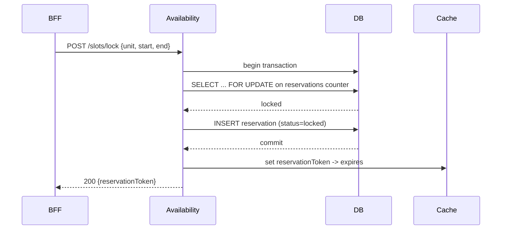

# Micro Arquitetura — Módulo: Availability / Slot Generator

> **Template usado:** `Gerador de Arquitetura Micro (Por Módulo)`.

**Autor:** Ryuji Morimoto — Wakagashira

**Versão:** 1.0

**Data:** 2025-12-03

**Bounded Context:** Disponibilidade e Reservas

**Responsabilidade (em uma frase):** Gerar janelas de disponibilidade por unidade/serviço/barbeiro, aplicar buffers e capacidades, e fornecer mecanismo atômico de lock/reservation para impedir double-booking.

Referências: template Micro v1.0, Guia de Modularização, Modelo de Entidades. fileciteturn0file14 fileciteturn0file6 fileciteturn0file3

---

## 1. Operações principais (Use Cases)

- **GenerateAvailability (Query)** — retorna janelas/slots para um dia/serviço/unidade
- **LockSlot (Command)** — reserva curta com token atômico
- **ReleaseSlot (Command)** — libera reserva (após cancelamento ou timeout)
- **RegisterException (Command)** — bloqueios manuais (feriados, manutenção)

---

## 2. Estrutura de pastas sugerida

```
modules/availability/
  ├── src/
  │    ├── controllers/
  │    │     └── availabilityController.ts
  │    ├── services/
  │    │     └── slotService.ts
  │    ├── domain/
  │    │     └── slotGenerator.ts
  │    ├── repository/
  │    │     ├── IReservationRepo.ts
  │    │     └── ReservationPgRepo.ts
  │    ├── cache/
  │    │     └── redisClient.ts
  │    ├── dtos/
  │    │     └── availability.dto.ts
  │    ├── integrations/
  │    │     └── calendarClient.ts
  │    └── tests/
  ├── deployment/
  └── README.md
```

---

## 3. Contratos (DTOs)

### GET /units/{id}/availability?service=&date=
Response sample (paginação por janela):
```json
{
  "unitId": "uuid",
  "date": "2025-12-03",
  "slots": [
    { "start": "2025-12-03T09:00:00Z", "end": "2025-12-03T09:30:00Z", "available": true },
    { "start": "2025-12-03T09:30:00Z", "end": "2025-12-03T10:00:00Z", "available": false }
  ]
}
```

### POST /slots/lock (request)
```json
{
  "unitId": "uuid",
  "serviceId": "uuid",
  "barberId": "uuid|null",
  "start": "2025-12-03T15:00:00Z",
  "end": "2025-12-03T15:30:00Z",
  "clientRequestId": "optional-idempotency"
}
```

### POST /slots/lock (response success)
```json
{
  "reservationToken": "resv_tok_abcdef123456",
  "expiresInSeconds": 120
}
```

---

## 4. Modelos e Persistência

**Reservation table (reserva temporária / persistida):**
- id (uuid)
- reservation_token (string)
- unit_id
- service_id
- barber_id
- start_datetime
- end_datetime
- created_at
- expires_at
- status (locked | released | confirmed)

**Observação:** Para V1, **usar tabela de reservations + row-level locking** (SELECT FOR UPDATE) na criação para garantir atomicidade.

---

## 5. Algoritmo de geração de slots (resumo)

Inputs: unit.hours (open/close), service.duracao, unit.capacidade_por_hora, buffer_minutes, exceptions

1. construir timeline do dia entre `hora_abre` e `hora_fecha`
2. gerar janelas com step = `duracao + buffer` (ou usar sliding window dependendo do UX)
3. aplicar capacidade: se `capacidade_por_hora > 1`, permitir múltiplas reservas por janela (controlar via contador)
4. remover janelas com conflitos (bookings confirmados + locked + exceptions)
5. cachear resultado por X segundos

**Nota de UX:** usar janelas baseadas em serviço.duração para evitar que cliente selecione start que não corresponda ao fim.

---

## 6. Fluxo de Lock (sequência)



**Timeout:** reservationToken expira em `expiresInSeconds` (ex: 120s). Se não for confirmado pelo Scheduling no tempo, é liberado.

---

## 7. Concorrência e contadores (capacidade por hora)

- Para `capacidade_por_hora > 1`, manter contador por `unitId+startInterval` (table counter ou Redis atomic counter).
- Recomendo inicial V1: contador em DB com row-level lock (mais robusto). Migrar para Redis CAS se load subir.

---

## 8. Invariantes e validações

- `start` e `end` devem estar alinhados com a granularidade do serviço
- não permitir locks que conflitem com reservas confirmadas (`Appointment`)
- validar `barberId` elegibilidade (se informada)
- validar `clientRequestId` para evitar duplo lock por replays

---

## 9. Erros e Códigos

- `409 Conflict` — slot já reservado/contador cheio
- `422 Unprocessable` — serviço/duração mismatch
- `400 Bad Request` — payload inválido
- `500 Internal` — falha infra

---

## 10. Caching e TTLs

- cache availability per unit+service+date por 10-30s (configurável)
- reservationToken TTL curto (ex: 120s)

---

## 11. Observabilidade

- métricas: `locks.attempts`, `locks.success`, `locks.conflicts`, `availability.cache.hit`
- traces: trace por clientRequestId/reservationToken

---

## 12. Tests

- Unit: slot generation (edge times, buffer), counter logic
- Integration: reservation insertion under concurrent requests
- E2E: lock -> create appointment -> confirmation -> reservation => confirmed

---

## 13. Payload de exemplo (POST /slots/lock)

Request:
```json
{
  "unitId": "7a6b5c4d-3e2f-1a0b-9c8d-7e6f5a4b3c2d",
  "serviceId": "3f2e1d0c-9b8a-7f6e-5d4c-3b2a1f0e9d8c",
  "barberId": null,
  "start": "2025-12-03T15:00:00Z",
  "end": "2025-12-03T15:30:00Z",
  "clientRequestId": "req-987654321"
}
```

Response:
```json
{ "reservationToken": "resv_tok_abcdef123456", "expiresInSeconds": 120 }
```

---

## 14. Checklist de conformidade (pré-merge)

- [ ] Geração de slots separada da persistência de reservations
- [ ] Locks atômicos via transaction/row-lock
- [ ] Counter para capacidade testado em concorrência
- [ ] TTLs e limpeza de reservations expiradas implementadas
- [ ] API idempotency por clientRequestId

---

*Fim do Documento Micro — Availability.*

